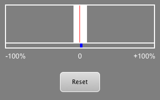

# Jitter Monitor



## Introduction

The Jitter Monitor VST 3 plug-in measures the time between ```Vst:IAudioProcessor::process(...)``` calls.

> !Warning! This plug-in is very experimental! The measurements may be incorrect!

## Getting Started

To clone and create the project, open a command prompt and proceed as follows:

### Windows

```sh
git clone https://github.com/rehans/jitter-monitor-plugin.git
mkdir build
cd build
cmake ../jitter-monitor-plugin
cmake --build .
```

### macOS

```sh
git clone https://github.com/rehans/jitter-monitor-plugin.git
mkdir build
cd build
cmake -GXcode ../jitter-monitor-plugin
cmake --build .
```

### Linux

```sh
git clone https://github.com/rehans/jitter-monitor-plugin.git
mkdir build
cd build
cmake -DCMAKE_BUILD_TYPE=Debug ../jitter-monitor-plugin
cmake --build .
```

As soon as the project has been successfully built, you will find the plugin bundle in the build folder: ```Debug/VST3/JitterMonitor.vst3```

## Getting Help

* Read through the SDK documentation on the **[VST 3 Developer Portal](https://steinbergmedia.github.io/vst3_dev_portal/pages/index.html)**


